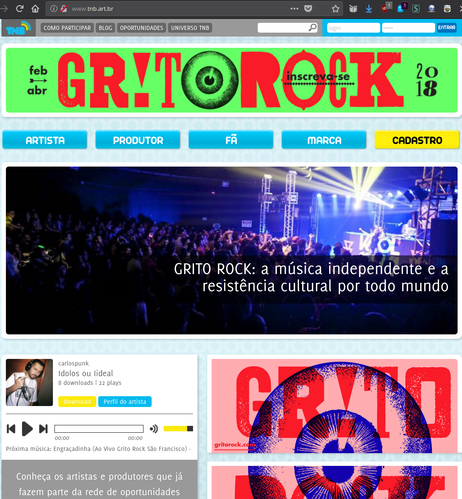
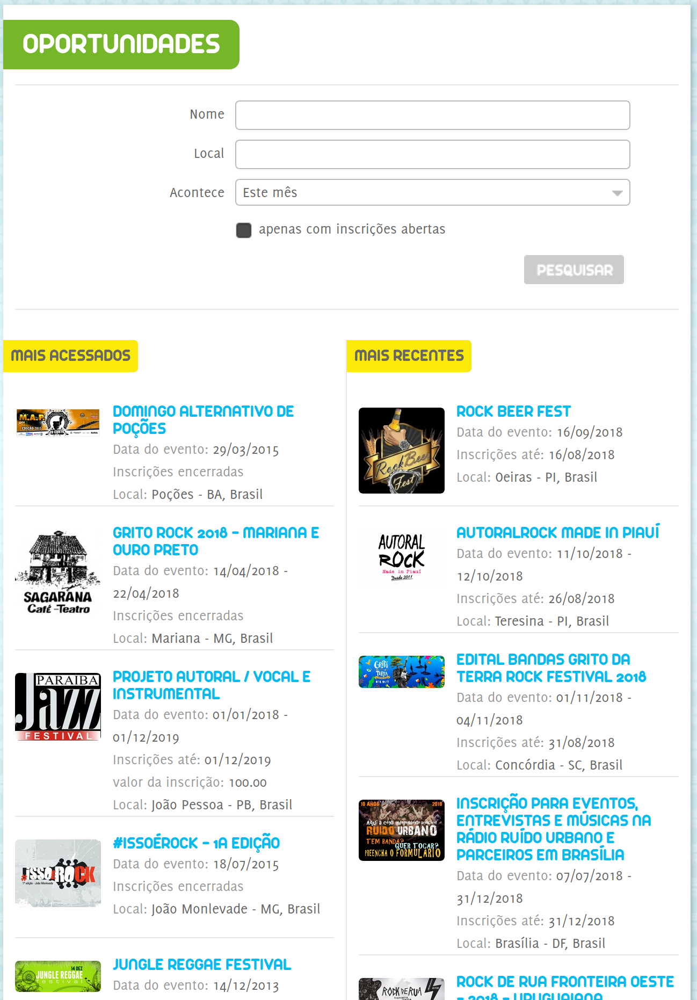
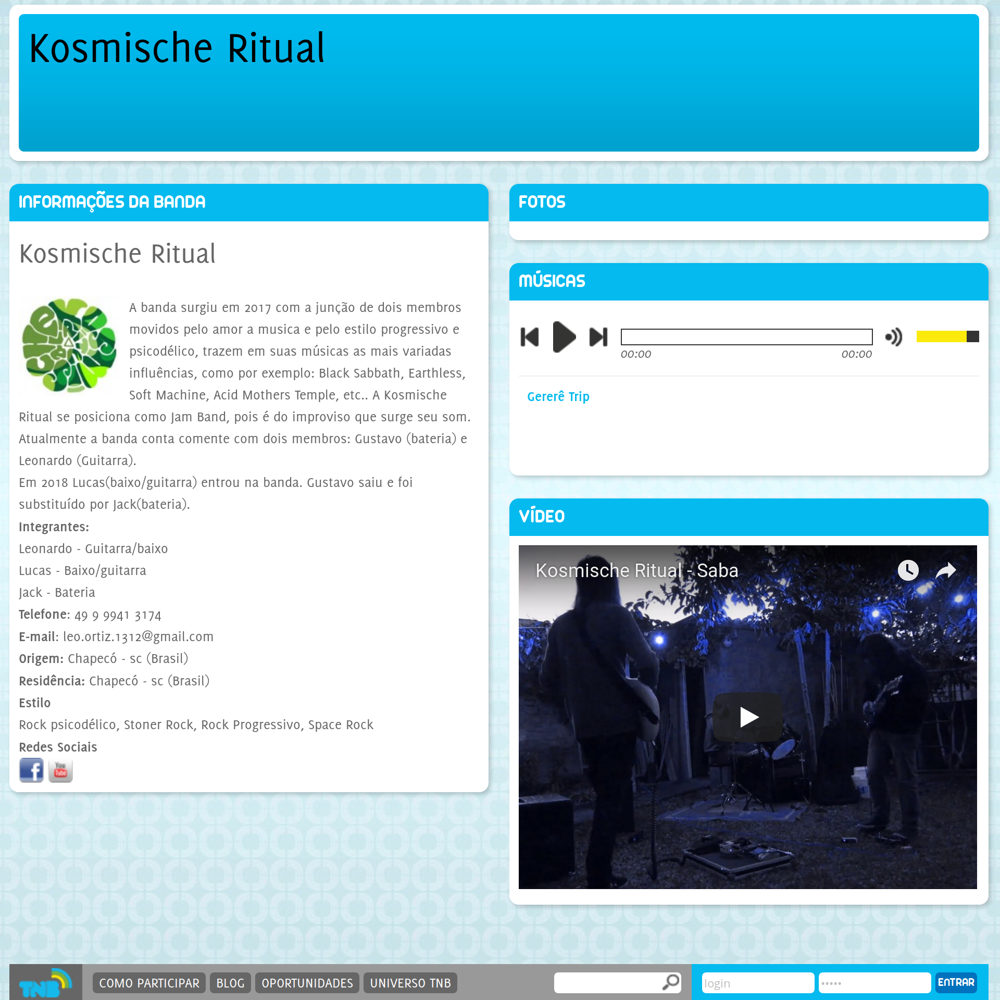

# Toque No Brasil
Projeto de conexão entre bandas, produtores e festivais no Brasil e no Mundo

### Status do Projeto

O código contido nesse repositório **ESTÁ DESCONTINUADO** pois diz respeito à primeira versão do TNB, implementada usando uma versão muito antiga do WordPress. 

Conheça os próximos passos do projeto nesta issue: https://github.com/ForaDoEixo/toquenobrasil/issues/6

Ou vá direto ao repositório do Novo TNB: https://github.com/ForaDoEixo/TNB2.0/issues/22

## Screenshots

## TNB.art.br
O Toque no Brasil (http://TNB.art.br) é uma plataforma de agenciamento online que segue a
lógica de rede social, para integrar, fortalecer e dinamizar a relação entre
artistas, produtores e público. No TNB, os artistas e produtores criam seus
respectivos perfis, onde podem carregar todo tipo de mídia (músicas, fotos,
vídeos, textos, etc), tendo seu portfólio disponível para divulgação, ao mesmo
tempo em que podem interagir uns com os outros, deixando recados, "curtindo" e
assim por diante. Ao passo que os produtores podem oferecer espaço e vagas para
shows em editais abertos dentro da plataforma, o que transforma o site numa
incrível ferramenta para curadoria, facilitando o contato direto e sem
intermediários entre produtores e artistas.

### Histórico
O site www.tnb.art.br foi lançado em 2010 e possui mais 30 mil artistas e 3 mil
produtores cadastrados, que foram acessadas por mais de 2,5 milhões de pessoas
diretamente na plataforma.

Assim, a plataforma TNB potencializa a criação e o desenvolvimento da música
independente, ao mesmo tempo que é um espaço de documentação e registro do que é
produzido por este segmento. A memória musical deste período não pode se perder.
Casos como o grande acervo do site nacional Trama Virtual ou do Myspace provam
que em tempos digitais a manutenção e o registro do trabalho de uma geração
inteira de música é uma tarefa árdua e que exige políticas de financiamento e
não podem ser apenas gerenciadas pelo mercado. Além disso, a plataforma TNB é
fonte de pesquisa para o cenário musical de uma época frívola e intensa, que se
não cuidada desaparece com a mesma velocidade que surgiu.
